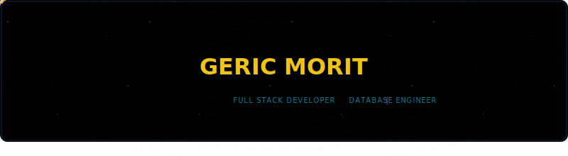
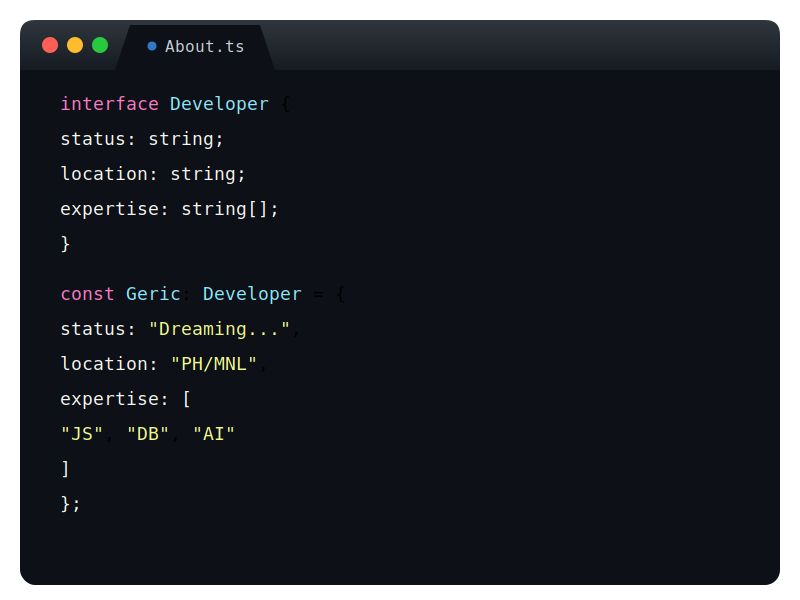
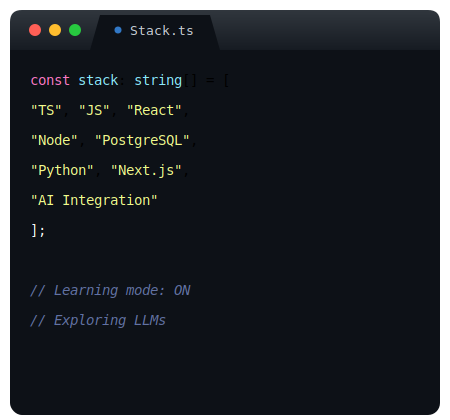
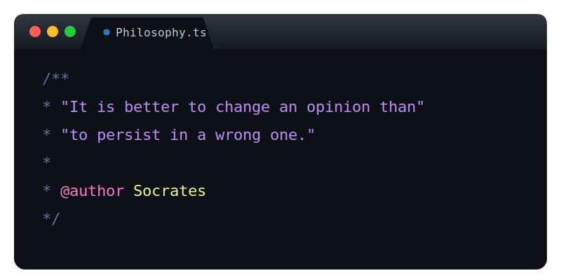

<!-- ═══════════════════ MASTER FRAME TOP ═══════════════════ -->

  

<!-- ═══════════════════ TOP BANNER ═══════════════════ -->

  

<!-- ═══════════════════ INFO & TECH ═══════════════════ -->

  
  

 

<!-- ═══════════════════ PAC-MAN SCREEN ═══════════════════ -->

  
  
  

<!-- ═══════════════════ DIVIDER ═══════════════════ -->

  

<!-- ═══════════════════ PHILOSOPHY ═══════════════════ -->

  

<!-- ═══════════════════ DIVIDER ═══════════════════ -->

  

<!-- ═══════════════════ CONTRIBUTION GRAPHS ═══════════════════ -->

  
  

<!-- ═══════════════════ 3D ARCADE LOG ═══════════════════ -->

  

<!-- ═══════════════════ MASTER FRAME BOTTOM ═══════════════════ -->

  

